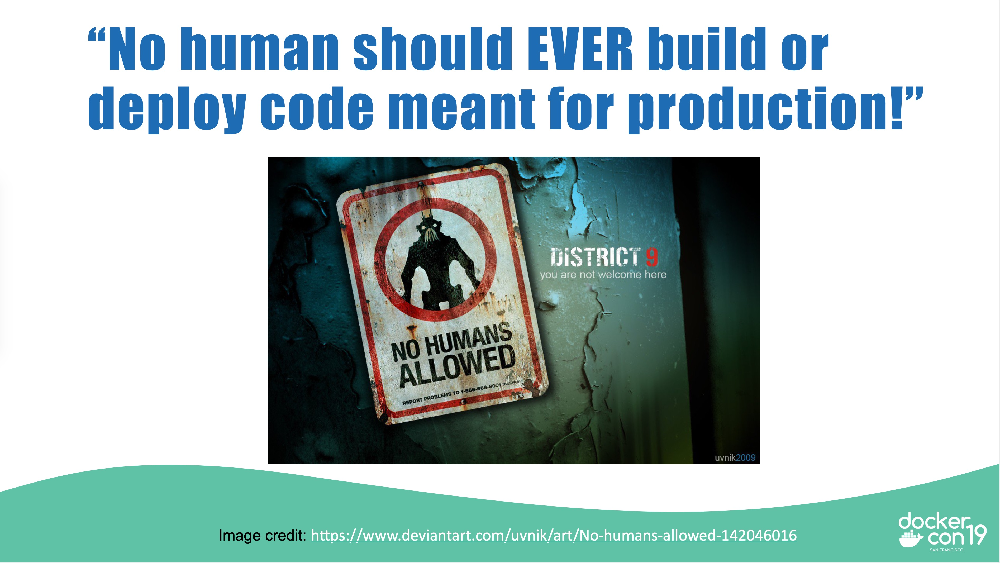

# Office Hours

## What is a Base Image

At it's core it should be a shell and a package manager. Anything more can give attackers capabilities.

## Why

Reduce surface area. Do not give you attackers the chance to move horizontally. Also set a baseline of a new base image for your enterprise. Level playing field?



## Where to Start

- Alpine
  - `docker pull alpine
- Centos
  - `docker pull centos`
- Ubuntu
  - `docker pull ubuntu`
- [UBI](https://www.redhat.com/en/blog/introducing-red-hat-universal-base-image)
  - `docker pull registry.access.redhat.com/ubi8/ubi`
  - `docker pull registry.access.redhat.com/ubi8/ubi-minimal`
  - `docker pull registry.access.redhat.com/ubi8/ubi-init`
  - [Redhat Docs](https://access.redhat.com/documentation/en-us/red_hat_enterprise_linux/8/html-single/building_running_and_managing_containers/index?lb_target=stage&extIdCarryOver=true&sc_cid=701f2000001OH6fAAG#using_standard_red_hat_base_images)
- Scratch
  - `FROM scratch`

## Inspect the images

We can use [Dive](https://github.com/wagoodman/dive).

## Remove the package manager

```bash
#centos/rhel
RUN rpm -e --nodeps rpm rpm-build-libs rpm-libs python3-rpm subscription-manager \
      python3-subscription-manager-rhsm yum $(rpm -qa *dnf*) python3-hawkey
```

```bash
#alpine
RUN apk --purge del apk-tools &&\
      rm -rf /var/cache/apk/*
```

```bash
#ubuntu
RUN dpkg -P --force-depends --force-remove-essential apt dpkg &&\
    rm -rf /var/cache/apt/
```

## Squash

Experimental mode needs to be enabled.

```bash
#centos
docker build -t test_centos --squash -f centos.dockerfile .

#ubuntu
docker build -t test_ubuntu --squash -f ubuntu.dockerfile .

#alpine
docker build -t test_alpine --squash -f alpine.dockerfile .
```

## MultiStage Builds

- [docs.docker.com](https://docs.docker.com/develop/develop-images/multistage-build/#use-multi-stage-builds)


## Dockercon 2020 Labels

- [Github](https://github.com/clemenko/dc20_labels)
- [YouTube](https://www.youtube.com/watch?v=PX1NyEKwEIU)